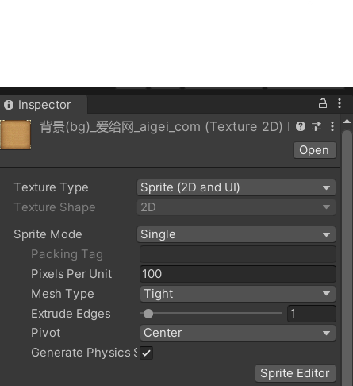

### 可展开公告栏

游戏代码: [游戏代码](https://github.com/Joshvon/unity_practice)
游戏演示视频: [演示视频](https://www.bilibili.com/video/BV1u8411A7eL/)

#### 编程内容
使用UnityUI实现一个简易的开展开公告栏

#### 实现思路
+ 组织游戏资源
  + 在`GameObject`菜单下的`UI`中新建一个`ScrollView`，在新建的`ScrollView`中添加一个`image`组件并添加图片（添加图片前要将图片的`Texture Type` 设置为`Sprite`），作为公告栏背景
  
  + 在`ScrollView`的`Content`中添加`Vertical Layout Group`和`Content Size Fitter`组件，为了适应背景图片，在`Vertical Layout Group`中设置了布局的边缘填充并将`Control Child Size：（控制子控件的大小）`的宽度勾选，将`Use Child Scale：（使用子控件的大小）`的高度勾选，将`Child Force Expand：（展开）`的宽度勾选；在`Content Size Fitter`中`Vertical Fit`设置为`Preferred Size`，这样不会出现滚动条无法下滑至底部的问题
  + 在`Content`中添加`Button`和`Text`，`Button`作为展开的触发器，而`Text`作为对应`Button`被点击后展开的文本，如果文本框内内容较多要设置`Text`的`Height`
+ 脚本设计
  公告的展开和收起是通过改变`Text`的角度和高度来实现的，同时在按钮触发的事件是使用了协程。将该脚本添加到每一个`Button`中并将对应的`Text`设置为脚本中的`text`
```csharp
public class Bulletin : MonoBehaviour {
 
    private Button yourButton;
    public Text text;
    private int frame = 20;
 
    // Use this for initialization
    void Start()
    {
        Button btn = this.gameObject.GetComponent<Button>();    //获取脚本搭载的按钮
        btn.onClick.AddListener(TaskOnClick);                   //在按钮的点击操作中添加事件
    }
 
    IEnumerator rotateIn()
    {
        float rx = 0;
        float xy = 120;
        for (int i = 0; i < frame; i++)
        {
            rx -= 90f / frame;
            xy -= 120f / frame;
            text.transform.rotation = Quaternion.Euler(rx, 0, 0);                                 //旋转相应的Text
            text.rectTransform.sizeDelta = new Vector2(text.rectTransform.sizeDelta.x, xy);       //改变Text大小
            if (i == frame - 1)
            {
                text.gameObject.SetActive(false);
            }
            yield return null;
        }
    }
 
    IEnumerator rotateOut()
    {
        float rx = -90;
        float xy = 0;
        for (int i = 0; i < frame; i++)
        {
            rx += 90f / frame;
            xy += 120f / frame;
            text.transform.rotation = Quaternion.Euler(rx, 0, 0);                                   //旋转相应的Text
            text.rectTransform.sizeDelta = new Vector2(text.rectTransform.sizeDelta.x, xy);         //改变Text大小
            if (i == 0) 
            {
                text.gameObject.SetActive(true);
            }
            yield return null;
        }
    }
 
 
    void TaskOnClick()
    {
        if (text.gameObject.activeSelf)
        {
            StartCoroutine(rotateIn()); //启动协程收起公告
        }
        else
        {
            StartCoroutine(rotateOut()); //启动携程展开公告
        }
        
    }
}
```
#### 演示结果
[](img/gif.gif)

[参考博客](https://blog.csdn.net/x2_yt/article/details/71330103)